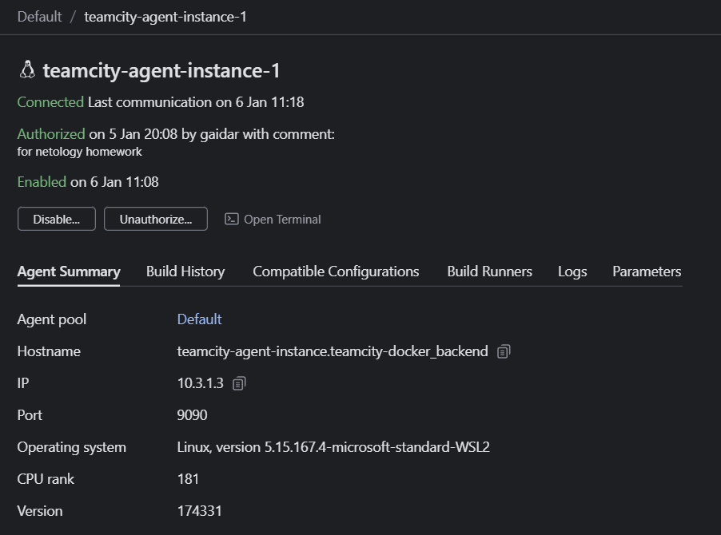
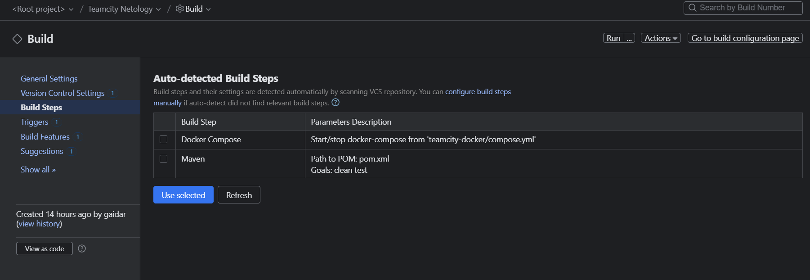
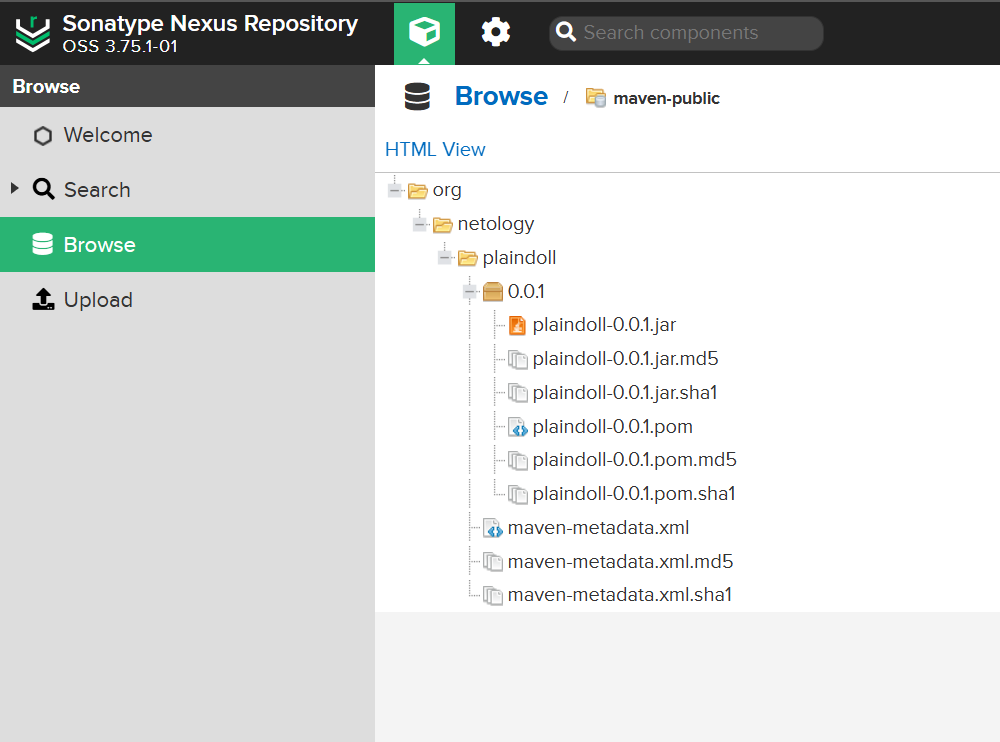
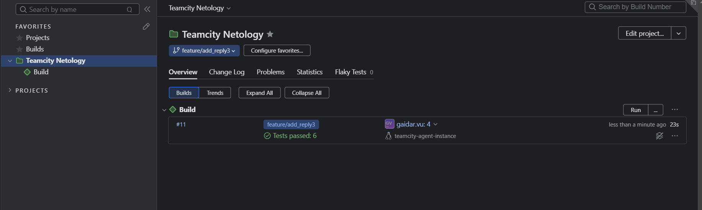
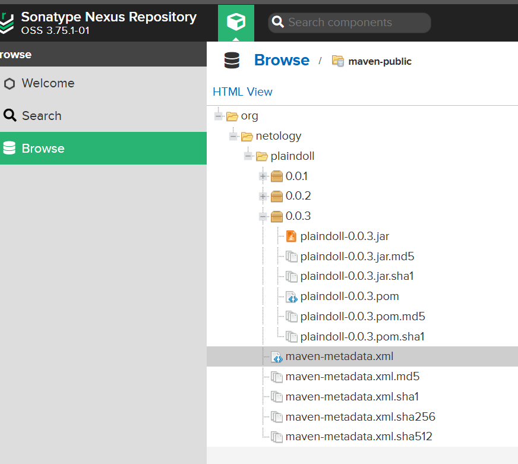
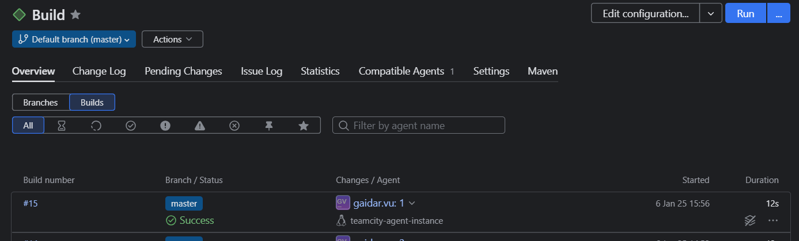

# Домашнее задание к занятию 11 «Teamcity»

Сервер Teamcity, агент и nexus поднимал в докере. [Compose файл](teamcity-docker/compose.yml)

Авторизованный Teamcity agent

Автоматически распознанные Build Steps

Сборка с версией 0.0.1 прошла успешно

Так-же появилась в Nexus

При добавлении новой ветки в репозиторий build запустился автоматически. Это случилось не с первого раза. Чтобы добиться положительного результата, пришлось создавать несколько веток. То версию забуду указать, то в ява коде ошибки и тд...

Так-же новый пакет появился в Nexus

После того, как сделал Merge ветки в master, тест запустил еще раз

У меня возникли сложности с миграцией build configuration в репозиторий. Конфигурация просто напросто не уезжала в репу. Не знаю насколько это разумно, выложил конфигурацию скринами:

