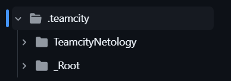

# Домашнее задание к занятию 11 «Teamcity»

Сервер Teamcity, агент и nexus поднимал в докере. [Compose файл](teamcity-docker/compose.yml)

## [Ссылка на репозиторий](https://github.com/gaidarvu/teamcity-netology/tree/master)

Авторизованный Teamcity agent

Автоматически распознанные Build Steps

Сборка с версией 0.0.1 прошла успешно

Так-же появилась в Nexus

При добавлении новой ветки в репозиторий build запустился автоматически. Это случилось не с первого раза. Чтобы добиться положительного результата, пришлось создавать несколько веток. То версию забуду указать, то в ява коде ошибки и тд...
[Log файл](Teamcity_Netology_Build_11.log) пройденого build

Так-же новый пакет появился в Nexus

После того, как сделал Merge ветки в master, тест запустил еще раз

build configuration в репозитории

